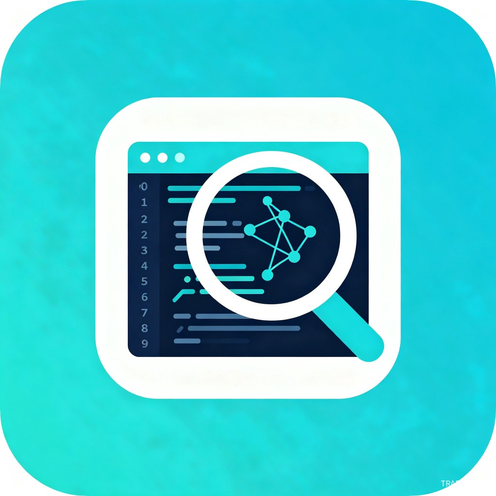

<p align="center">
  
</p>

<h1 align="center">AgentLens</h1>

<p align="center">
  <strong>Lightweight AI Coding Agent Session Intelligence Analysis Engine</strong><br/>
  轻量级AI编码代理会话智能分析引擎
</p>

<p align="center">
  
  
  
  
  
  
</p>

<p align="center">
  <a href="#-quick-start">Quick Start</a> |
  <a href="#-features">Features</a> |
  <a href="#-supported-agents">Supported Agents</a> |
  <a href="docs/README.zh-TW.md">繁體中文</a> |
  <a href="docs/README.en.md">English</a>
</p>

---

## Introduction

AgentLens is a lightweight, zero-dependency CLI tool that intelligently analyzes your AI coding agent sessions. It automatically detects session data from Claude Code, Cursor, Trae, Windsurf, Copilot, Aider, and more, providing deep insights into your usage patterns, token consumption, costs, and optimization opportunities.

**Why AgentLens?** As AI coding agents become essential tools for developers, understanding how you use them — and how much they cost — is critical. AgentLens gives you a clear, actionable view of your AI coding workflow.

## Features

- **Multi-Agent Support** — Auto-detect and parse sessions from 10+ AI coding agents
- **Cost Intelligence** — Track token usage and costs across models with smart projections
- **Usage Analytics** — Daily/weekly patterns, peak hours, session length distribution
- **Terminal Dashboard** — Beautiful colored TUI dashboard with progress bars
- **Multi-Format Export** — JSON, CSV, Markdown, SARIF for CI/CD integration
- **Optimization Tips** — AI-powered suggestions to reduce costs and improve efficiency
- **Zero Dependencies** — Pure Python 3.8+, single-file install, cross-platform
- **Privacy First** — 100% local analysis, no data leaves your machine

## Quick Start

### Install

```bash
# From PyPI (recommended)
pip install agentlens

# Or install from source
git clone https://github.com/gitstq/AgentLens.git
cd AgentLens
pip install -e .
```

### Usage

```bash
# Detect installed AI coding agents
agentlens agents

# Show analysis dashboard
agentlens dashboard

# Scan and analyze sessions
agentlens scan

# Show cost analysis with projections
agentlens cost

# List recent sessions
agentlens sessions --limit 10

# Export as Markdown report
agentlens export --format markdown --output report.md

# Export as CSV
agentlens export --format csv --output analysis.csv

# Export as SARIF (for CI/CD)
agentlens export --format sarif --output results.sarif

# Scan specific agent
agentlens scan --agent claude-code

# Scan custom directory
agentlens scan --path /path/to/sessions
```

## Supported Agents

| Agent | Status | Parser |
|-------|--------|--------|
| Claude Code | Full Support | JSON/JSONL |
| Cursor | Full Support | JSON |
| Trae | Full Support | JSON/JSONL |
| Windsurf | Full Support | JSON |
| GitHub Copilot | Basic Support | JSON |
| Aider | Basic Support | JSONL |
| Continue | Basic Support | JSON |
| Tongyi Lingma | Basic Support | JSON |
| Codeium | Basic Support | JSON |
| Generic | Fallback | JSON/JSONL/Text |

## Detailed Guide

### Commands

| Command | Description |
|---------|-------------|
| `agentlens agents` | List detected agent data directories |
| `agentlens scan` | Scan and analyze all sessions |
| `agentlens dashboard` | Show interactive TUI dashboard |
| `agentlens sessions` | List sessions with details |
| `agentlens cost` | Show detailed cost analysis |
| `agentlens export` | Export results in multiple formats |

### Cost Tracking

AgentLens tracks costs across all your AI coding sessions:

```bash
$ agentlens cost

  Cost Analysis
  ──────────────────────────────────

  Total Cost:         $0.0350
  Total Tokens:       15.2K
  Avg Cost/Session:   $0.0175

  Cost Trend (Daily)
  2026-06-14  ████████████████████████████ $0.0200
  2026-06-13  ██████████████░░░░░░░░░░░░░ $0.0150

  Model Efficiency
  claude-3.5-sonnet         $0.0200  (2 sessions)
  gpt-4o                   $0.0150  (1 session)

  Monthly Projection
  Projected Monthly:  $0.90
  Daily Average:      $0.03
  Confidence:         medium
```

### Export Formats

- **JSON** — Structured data for programmatic access
- **CSV** — Spreadsheet-compatible tabular data
- **Markdown** — Human-readable reports with tables
- **SARIF** — Static Analysis Results for GitHub Actions integration

## Design & Architecture

```
AgentLens/
├── src/agentlens/
│   ├── models/       # Data models (Session, Message, CostRecord)
│   ├── parsers/      # Agent-specific session parsers
│   ├── analyzers/    # Session, cost, and usage analyzers
│   ├── exporters/    # Multi-format export (JSON/CSV/MD/SARIF)
│   ├── ui/           # Terminal UI (colors, tables, dashboard)
│   ├── utils/        # Utilities (cost estimation, path detection)
│   └── cli.py        # CLI entry point
├── tests/            # Unit tests (28 tests, 100% pass)
├── assets/           # Project logo
└── pyproject.toml    # Build configuration
```

### Key Design Decisions

1. **Zero Dependencies** — No external packages required, works everywhere Python runs
2. **Parser Registry** — Extensible architecture for adding new agent parsers
3. **Approximate Token Counting** — Heuristic-based estimation (4 chars/token EN, 1.5 chars/token CJK)
4. **Local-First** — All analysis happens on your machine, no cloud calls

## Roadmap

- [ ] Web UI dashboard
- [ ] Historical trend charts
- [ ] Session comparison and diff
- [ ] Plugin system for custom analyzers
- [ ] Real-time session monitoring
- [ ] Team/shared analytics
- [ ] VS Code extension

## Contributing

Contributions are welcome! Please follow these steps:

1. Fork the repository
2. Create a feature branch (`git checkout -b feature/amazing-feature`)
3. Commit your changes (`git commit -m 'feat: add amazing feature'`)
4. Push to the branch (`git push origin feature/amazing-feature`)
5. Open a Pull Request

Please read [CONTRIBUTING.md](CONTRIBUTING.md) for details on our code of conduct and development process.

## License

This project is licensed under the MIT License — see the [LICENSE](LICENSE) file for details.

---

<p align="center">
  Built with Python by <a href="https://github.com/gitstq">AgentLens Team</a>
</p>
